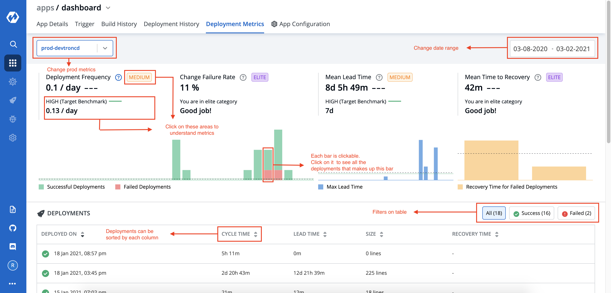

# Deployment Metrics
Deployment Metrics are available for production only environments. 
Provides graphs and metrics to users to monitor and improve their performance. It is based on data not older than six months.
Data is presented in form of graphs as well as the tabular format.

## Graphs
- Deployment Frequency: 
  - number of deployments within a time interval vs time graph. 
  - change failure rate: how often does the deployment fail?
- Max Lead Time
    - max lead time within a time interval vs time graph
    - lead time is the length of time between code commited and code running on production
- Mean Time to Recovery
    - each bar represents a failed deployment and height represents the recovery time
    - time to recover from failures

Length of `time interval` will depend on the date range selected by user. If date range is more than 30 days, interval will be 7 days long otherwise it will 1 day long.

###### Additional info
Users are provided with additional metrics to give an idea where his performance stands. They are given well defined categories namely elite, high, medium and low, and each category has a benchmark that tells you what should user be targeting next. 

## Deployments
This is the same data on which the graphs have been created, presented in tabular format. 

###### Read more
[Case study on deployment metrics](https://devtron.ai/blog/a-case-study-of-designing-dashboards-to-optimize-agile-process/)
